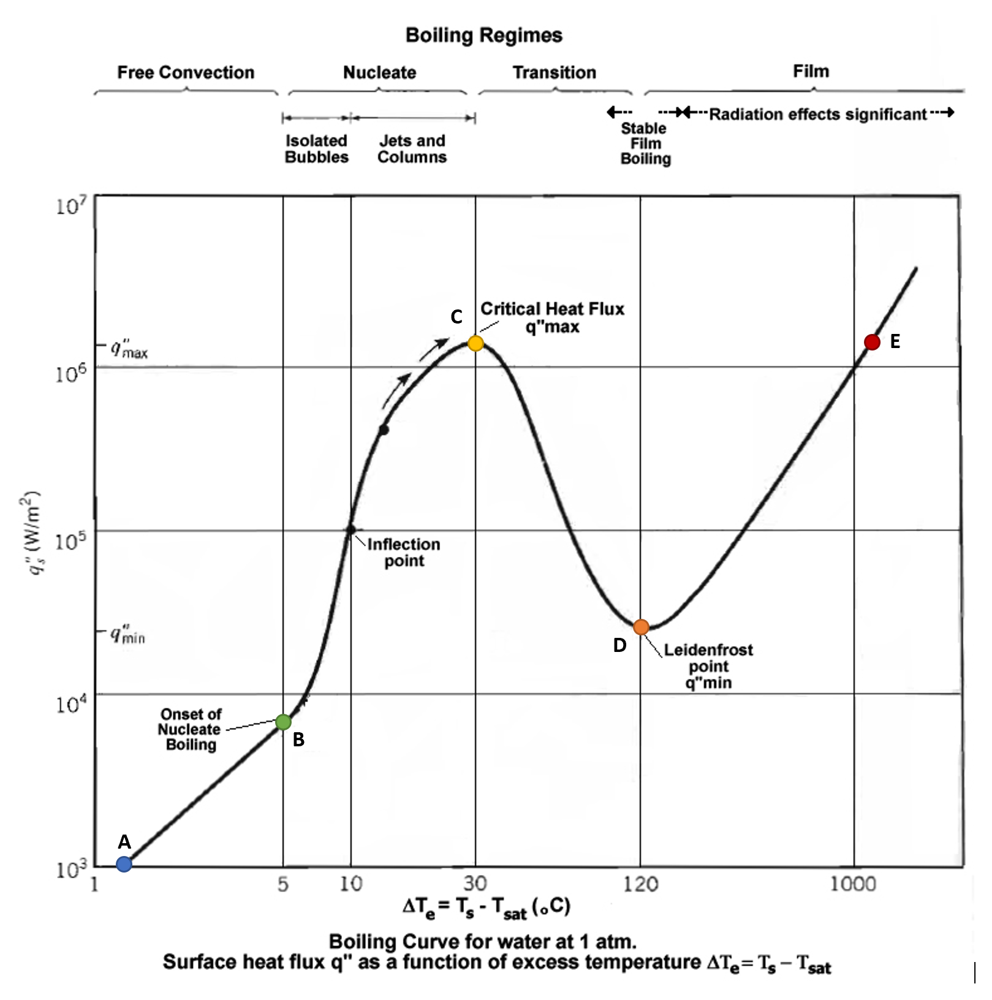

# ENGR 102 Lab Topic 5 (individual)

## Activities
There are two deliverables for this individual assignment. Please submit the files described below to Canvas and Gradescope. Check out the [Frequently Asked Questions](#frequently-asked-questions) below. **Please include the individual header in your ~.py file.**

1. [Boiling Curve](#boiling-curve)

## Boiling Curve
Create a Python program that will calculate the surface heat flux ($$q_s^"$$) for water at 1 atm for a given excess temperature ($$∆T_e$$). You will need to create a simplified model for the relationship between heat flux and excess temperature, based on the graph below ([from Wikipedia](https://en.wikipedia.org/wiki/Nucleate_boiling) where you can learn more about nucleate boiling). The boiling curve is important in several engineering disciplines. It identifies the boiling regime, which then helps to determine the heat transfer coefficient, as well as physically what is going on. Different fluids have different boiling curves, however they all have a similar shape.

### Part 1
For this part of the assignment, put together a document you will use to plan your program. You will submit a PDF of this document titled `boiling_curve_planning.pdf` to Canvas. Do this **before** you start to code.

First, examine the boiling curve. The curve starts out with a linear region for free convection, where boiling has not yet started (points `A` to `B`). The onset of nucleate boiling (`B`) starts at 5 °C of excess temperature and continues roughly linearly until the critical heat flux (`C`) is reached. This portion of the curve (`B` to `C`) is the nucleate boiling regime, which is what we typically see when boiling water for cooking pasta. There is a negative roughly linear trend from the critical heat flux down to the Leidenfrost point (`D`) which is the transition region (`C` to `D`), followed by an upward nearly linear film region (`D` to `E`). You do **NOT** need to understand the physics behind the boiling curve for this assignment. 

Develop a simplified, purely linear model of the boiling curve. In other words, approximate the curve by a series of four **straight-line segments** between the labeled points. The lines should begin at point `A` and end at point `E`. Using more lines would give a more accurate representation, but would be more work in coding; for this assignment, you do not need to be precise, and should use just 4 segments along with **the points given below the graph**. You may want to review the process for linear interpolation posted in Module 2 on Canvas, and see the note below the graph.


**Points:**  `A: (1.3, 1000)`  `B: (5, 7000)`  `C: (30, 1.5x10^6)`  `D: (120, 2.5x10^4)`  `E: (1200, 1.5x10^6)`

**Note:** This graph is a log-log plot (both axes are on a logarithmic scale) so the normal equation for linear interpolation won't work. Instead, use the following equations:

$$y=y_0\left(\frac{x}{x_0}\right)^m$$
$$m=\frac{\log⁡(y_1⁄y_0)}{\log⁡(x_1⁄x_0)}$$

Remember that in Python, `log(x)` is the natural logarithm and `log10(x)` is the base-10 logarithm.

You'll now work on taking your linear approximation of the boiling curve, and creating a program that can evaluate it for you (given an excess temperature, calculate and report the surface heat flux). 

Next, consider what values you need to store, and the general steps you will need to follow in your program. 
- Make a list of the variables you think you will need, and the names you will use
- Create a sequence of steps that you will follow 
  - If you have a conditional statement (you should have a few!), you might want to indicate each part of the condition as a separate action
  - The computation will involve a few stages, please separate the stages into different parts; do not just say "compute surface heat flux"

Next, create a list of test cases that you will use in your program. Be sure to handle both "typical" and "edge" cases. **Do this before writing the program itself!**
- Similar to the group activity, for each test case provide the input, the expected output, and identify the type of case ("typical" or "edge")
- Note that you should try to come up with a complete set of test cases that thoroughly test the idea (you should have **at least** 10 test cases)
- Your program should handle input excess temperatures outside the provided range on the graph by printing a message to the screen
 
*Your PDF should contain your variable list, your sequence of steps, and your test cases.*

### Part 2
**AFTER** completing Part 1, construct your program and name the file `boiling_curve.py`. Your program should ask users for an excess temperature, and report the surface heat flux. As you write your program, please be sure to do the following: 
- Include comments for your program. It’s a good idea to begin by converting your sequence of steps into comments. 
- Develop incrementally. Write some code then test it before writing the next section of code.   
- Be sure your program runs and passes all of your test cases. You can submit your code as many times as you want to Gradescope. This is a good way to check your code and see if it passes Dr. Ritchey’s test cases.
- Your code should output in the format below, rounding to the nearest integer for the calculated surface heat flux.

Example output (using input: `3`)
```
Enter the excess temperature: 3
The surface heat flux is approximately 3347 W/m^2
```
Example output (using input: `-1`)
```
Enter the excess temperature: -1
Surface heat flux is not available
```


## Frequently Asked Questions
1. **What points do I use from the graph?** Use the ones written at the bottom of the second page (below the graph).

2. **Activity 1 do I need to show my calculations in the pdf?** You don't need to write out the math if you provide a brief description instead. In your sequence of steps you can say something like 'calculate slope'. Of course, you are more than welcome to hand write equations, take a picture, and insert in your document.

3. **Activity 2 Gradescope tells me to add more comments. How many comments are enough?** [That's kind of a philosophical question](The_Commento.pdf). Remember what we talked about in lecture? Write your steps out in comments, then fill in the code. If you did that, you have enough comments. If you skipped that step... go back and comment your code!

Have a question you don't see here? Email your instructor!

Based upon Dr. Keyser’s Original<br/>
Revised Summer 2025 SNR
